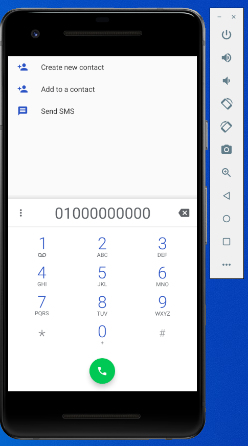
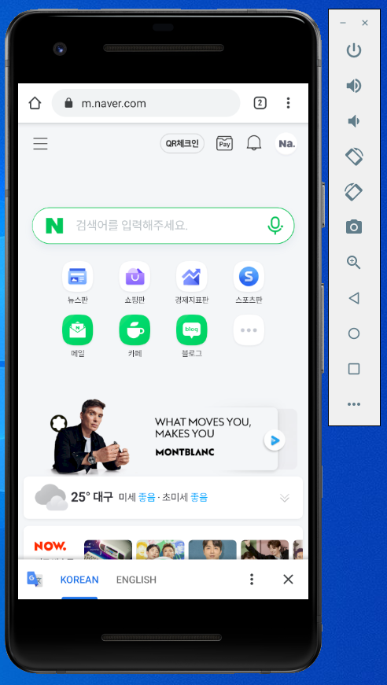

# 20173054 김세빈

## 1주차

## 2주차

</img>

## 3주차

</img>
</img>

## 4주차

  - Pet Body Check
     - 반려동물과 함께 많은 사람들이 살아가고 있는 지금, 우리의 가족인 반려동물의 건강상태를 꾸준히, 간단히 체크할 수 있는 앱을 기획하고싶었습니다. 
     - 반려동물의 변의 상태, 피부 상태 등등 사진을 스캔하여 간단하게 건강상태를 체크 할 수 있게 기획.
     - 반려동물의 상태를 더욱 자세하게 알 수 있게 하기 위해 앱 내에서 전문의와 상담이 가능한 앱 기획.

## 5주차

</img>
</img>

## 6주차

</img>
</img>
